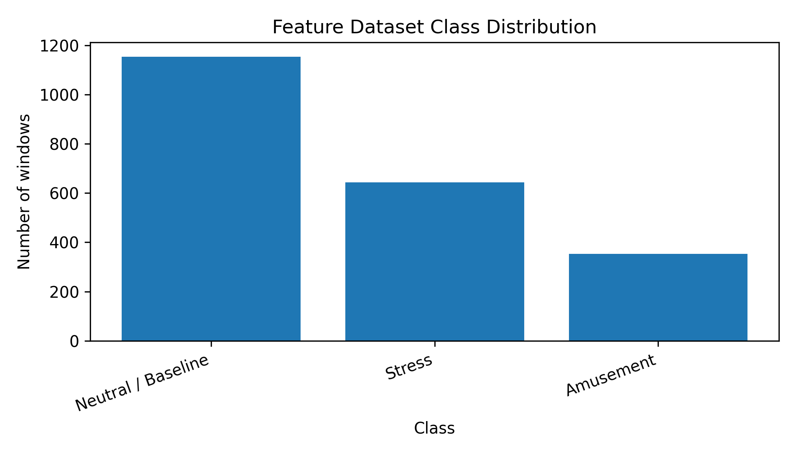
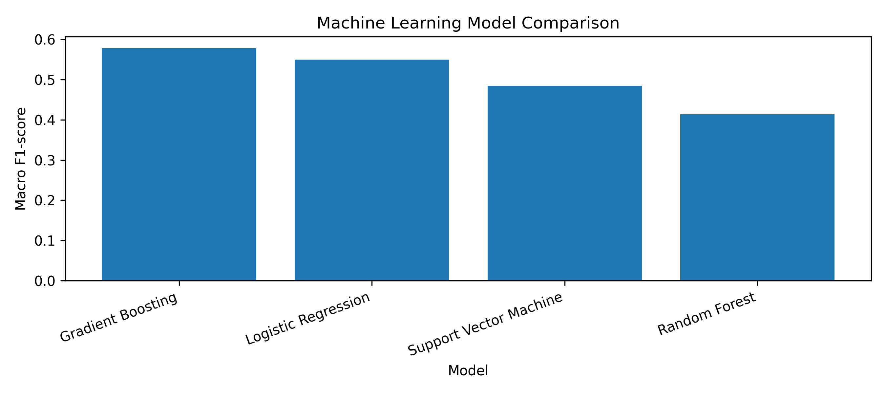
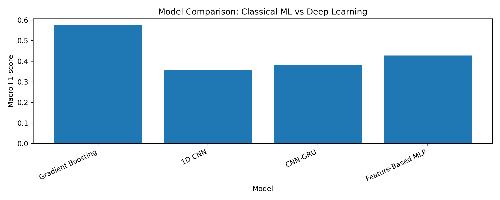
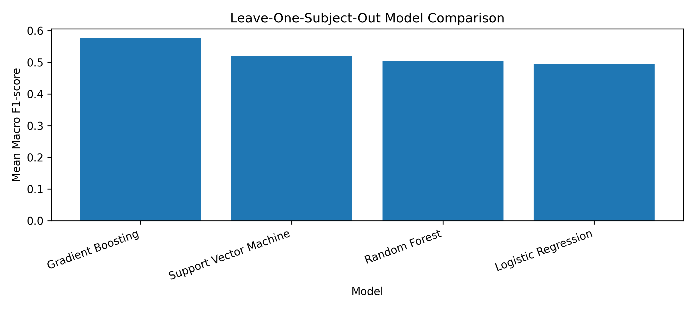
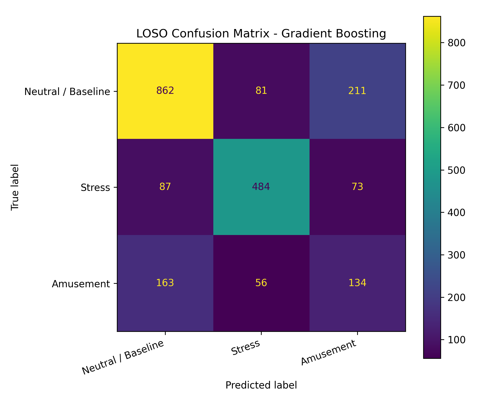

# Wearable Stress Detection using Physiological Signals and Machine Learning

## Overview

This project develops a complete machine learning and deep learning pipeline for wearable stress detection using physiological signals from the WESAD dataset.

The goal is to classify physiological signal windows into three affective states:

- Neutral / Baseline
- Stress
- Amusement

The project includes raw signal exploration, preprocessing, window segmentation, feature extraction, classical machine learning, raw-signal deep learning, feature-based deep learning, and Leave-One-Subject-Out cross-validation.

---

## Dataset

This project uses the **WESAD: Wearable Stress and Affect Detection** dataset.

The dataset contains physiological and motion sensor data collected from wearable devices during a laboratory-based stress and affect study.

Signals used in this project:

- ECG
- EDA / GSR
- Respiration
- Temperature

The dataset is not included in this repository because of its size. Users should download the dataset manually from the official WESAD source and place it inside the `data/` folder.

Expected local dataset structure:

```text
data/
└── WESAD/
    ├── S2/
    │   └── S2.pkl
    ├── S3/
    │   └── S3.pkl
    ├── S4/
    │   └── S4.pkl
    └── ...
```

---

## Project Objectives

The main objectives of this project are:

- Load and explore physiological signals from the WESAD dataset
- Visualize ECG, EDA, respiration, and temperature signals
- Segment continuous time-series signals into fixed-size windows
- Extract statistical and signal-change features
- Train classical machine learning models
- Train raw-signal deep learning models
- Train feature-based neural networks
- Evaluate models using subject-independent testing
- Perform Leave-One-Subject-Out cross-validation
- Compare classical ML and deep learning approaches

---

## Classes

The following WESAD labels are used:

| Label | Class |
|---:|---|
| 1 | Neutral / Baseline |
| 2 | Stress |
| 3 | Amusement |

The following labels are excluded:

| Label | Reason |
|---:|---|
| 0 | Undefined / transition |
| 4 | Meditation / not used in this project |

---

## Methodology

### 1. Data Exploration

The first notebook loads one subject and explores the structure of the WESAD dataset.

Explored components:

- Dataset dictionary structure
- Chest sensor signals
- Wrist sensor signals
- Label distribution
- Raw ECG, EDA, respiration, and temperature plots

---

### 2. Window Segmentation

The continuous physiological signals are divided into fixed-size windows.

Windowing configuration:

| Parameter | Value |
|---|---:|
| Sampling rate | 700 Hz |
| Window size | 30 seconds |
| Window size in samples | 21,000 |
| Overlap | 50% |
| Step size | 15 seconds |
| Signals used | ECG, EDA, Respiration, Temperature |

A majority-label strategy is used to assign one label to each window. Windows with unclear or mixed labels are removed using a majority-ratio threshold.

---

### 3. Feature Extraction

For each 30-second window, statistical and signal-change features are extracted from each physiological signal.

Extracted feature types include:

- Mean
- Standard deviation
- Minimum
- Maximum
- Median
- Range
- 25th percentile
- 75th percentile
- Interquartile range
- RMS
- Energy
- Mean absolute change
- Standard deviation of change
- Maximum absolute change
- Zero crossings
- Skewness
- Kurtosis

The final feature dataset contains:

| Item | Value |
|---|---:|
| Number of windows | 2151 |
| Number of features | 68 |
| Number of subjects | 15 |

---

## Models

This project compares both classical machine learning and deep learning models.

### Classical Machine Learning Models

- Logistic Regression
- Random Forest
- Support Vector Machine
- Gradient Boosting

### Deep Learning Models

- 1D CNN using raw physiological signal windows
- CNN-GRU using raw physiological signal windows
- Feature-Based MLP using extracted physiological features

---

## Evaluation Strategy

Two evaluation strategies are used.

### 1. Subject-Independent Train/Test Split

The data is split by subject, meaning test subjects are not seen during training.

This is more realistic than random window splitting because the model must generalize to unseen people.

---

### 2. Leave-One-Subject-Out Cross-Validation

Leave-One-Subject-Out, or LOSO, is used for stricter subject-independent evaluation.

In each fold:

- One subject is used as the test subject
- All remaining subjects are used for training
- The process is repeated until every subject has been used once as the test subject

This gives a stronger estimate of how well the model generalizes to new users.

---

## Results

### Single Subject-Independent Train/Test Split

| Model | Type | Accuracy | Macro F1 |
|---|---|---:|---:|
| Gradient Boosting | Classical ML | 0.7067 | 0.5775 |
| 1D CNN | Raw-Signal Deep Learning | 0.3788 | 0.3584 |
| CNN-GRU | Raw-Signal Deep Learning | 0.4642 | 0.3803 |
| Feature-Based MLP | Feature-Based Deep Learning | 0.4642 | 0.4274 |

The best model in the single split experiment was **Gradient Boosting**.

---

### Leave-One-Subject-Out Cross-Validation

| Model | Mean Accuracy | Std Accuracy | Mean Macro F1 | Std Macro F1 |
|---|---:|---:|---:|---:|
| Gradient Boosting | 0.6871 | 0.1638 | 0.5769 | 0.1805 |
| Support Vector Machine | 0.6128 | 0.1976 | 0.5192 | 0.1307 |
| Random Forest | 0.6897 | 0.1128 | 0.5037 | 0.1354 |
| Logistic Regression | 0.5896 | 0.1986 | 0.4948 | 0.1648 |

The best LOSO model was **Gradient Boosting**, with:

| Metric | Value |
|---|---:|
| Mean Accuracy | 0.6871 |
| Standard Deviation Accuracy | 0.1638 |
| Mean Macro F1 | 0.5769 |
| Standard Deviation Macro F1 | 0.1805 |
| Number of subjects | 15 |
| Number of windows | 2151 |
| Number of features | 68 |

---

## Key Finding

Classical machine learning with handcrafted physiological features outperformed raw-signal deep learning models in this project.

The results suggest that for small wearable physiological datasets, feature engineering remains highly effective, especially when subject-independent generalization is required.

Although the deep learning models improved from the initial 1D CNN to CNN-GRU and Feature-Based MLP, they did not outperform Gradient Boosting.

---

## Result Visualizations

### Feature Class Distribution



### Classical ML Model Comparison



### All Model Comparison



### Leave-One-Subject-Out Model Comparison



### LOSO Best Model Confusion Matrix



---

## Repository Structure

```text
wearable_stress_detection/
│
├── README.md
├── requirements.txt
├── .gitignore
│
├── data/
│   ├── README.md
│   ├── WESAD/              # Not uploaded to GitHub
│   └── processed/          # Not uploaded to GitHub
│
├── notebooks/
│   ├── 01_data_exploration.ipynb
│   ├── 02_preprocessing_window_segmentation.ipynb
│   ├── 03_feature_extraction.ipynb
│   ├── 04_machine_learning_models.ipynb
│   ├── 05_deep_learning_models.ipynb
│   ├── 06_improved_deep_learning_models.ipynb
│   ├── 07_feature_based_neural_network.ipynb
│   └── 08_leave_one_subject_out_evaluation.ipynb
│
├── results/
│   ├── preprocessing_summary.csv
│   ├── feature_extraction_summary.csv
│   ├── ml_model_comparison.csv
│   ├── dl_summary.csv
│   ├── improved_dl_summary.csv
│   ├── feature_mlp_summary.csv
│   ├── loso_model_summary.csv
│   ├── loso_final_summary.csv
│   └── figures and reports
│
├── models/
│   └── trained model files       # Not uploaded to GitHub
│
└── app/
    └── future Streamlit app
```

---

## Notebooks

| Notebook | Description |
|---|---|
| `01_data_exploration.ipynb` | Loads and explores one WESAD subject, plots raw signals and labels |
| `02_preprocessing_window_segmentation.ipynb` | Segments continuous signals into 30-second windows |
| `03_feature_extraction.ipynb` | Extracts statistical and signal-change features |
| `04_machine_learning_models.ipynb` | Trains classical ML models |
| `05_deep_learning_models.ipynb` | Trains a raw-signal 1D CNN |
| `06_improved_deep_learning_models.ipynb` | Trains an improved CNN-GRU model |
| `07_feature_based_neural_network.ipynb` | Trains a feature-based MLP neural network |
| `08_leave_one_subject_out_evaluation.ipynb` | Performs LOSO cross-validation |

---

## How to Run

### 1. Clone the repository

```bash
git clone https://github.com/YOUR_USERNAME/wearable_stress_detection.git
cd wearable_stress_detection
```

Replace `YOUR_USERNAME` with your GitHub username.

---

### 2. Create a virtual environment

On Windows PowerShell:

```powershell
python -m venv venv
.\venv\Scripts\activate
```

On macOS or Linux:

```bash
python -m venv venv
source venv/bin/activate
```

---

### 3. Install requirements

```bash
pip install -r requirements.txt
```

---

### 4. Download the dataset

Download the WESAD dataset manually from the official source.

Place the extracted dataset inside:

```text
data/WESAD/
```

The expected structure is:

```text
data/WESAD/S2/S2.pkl
data/WESAD/S3/S3.pkl
data/WESAD/S4/S4.pkl
...
```

---

### 5. Run notebooks in order

Run the notebooks in this order:

```text
01_data_exploration.ipynb
02_preprocessing_window_segmentation.ipynb
03_feature_extraction.ipynb
04_machine_learning_models.ipynb
05_deep_learning_models.ipynb
06_improved_deep_learning_models.ipynb
07_feature_based_neural_network.ipynb
08_leave_one_subject_out_evaluation.ipynb
```

The processed data files and trained models are created locally and are not uploaded to GitHub.

---

## Important GitHub Notes

The following files and folders are intentionally excluded from GitHub:

```text
data/WESAD/
data/processed/
models/*.pkl
models/*.joblib
models/*.h5
models/*.pt
```

This is because the dataset and trained model files can be large.

---

## Technologies Used

- Python
- NumPy
- Pandas
- Matplotlib
- Scikit-learn
- PyTorch
- Jupyter Notebook

---

## Main Skills Demonstrated

This project demonstrates:

- Physiological signal processing
- Time-series window segmentation
- Feature extraction
- Classical machine learning
- Deep learning for time-series classification
- Subject-independent model evaluation
- Leave-One-Subject-Out cross-validation
- Model comparison and result interpretation
- GitHub project organization

---

## Conclusion

This project developed a complete wearable stress detection pipeline using ECG, EDA, respiration, and temperature signals from the WESAD dataset.

The best-performing model was **Gradient Boosting**, achieving a mean LOSO macro F1-score of **0.5769** across 15 subjects.

The results show that handcrafted physiological features are effective for wearable stress classification when the dataset is small and subject-independent generalization is required.

---

## Future Work

Possible future improvements include:

- Add wrist sensor signals such as BVP, wrist EDA, wrist temperature, and wrist acceleration
- Add heart-rate variability features from ECG
- Add EDA-specific features such as tonic and phasic components
- Improve deep learning models using 1D ResNet or Temporal Convolutional Networks
- Add hyperparameter tuning
- Build a Streamlit demo app
- Evaluate binary classification, such as stress vs non-stress
- Compare subject-dependent and subject-independent evaluation settings

---

## Project Status

Completed:

- Dataset exploration
- Preprocessing and window segmentation
- Statistical feature extraction
- Classical machine learning model comparison
- Raw-signal 1D CNN experiment
- Improved CNN-GRU experiment
- Feature-based neural network experiment
- Leave-One-Subject-Out cross-validation

---

## Author

**Lihini Karunarathne**

Machine Learning / Deep Learning portfolio project for wearable physiological stress detection.